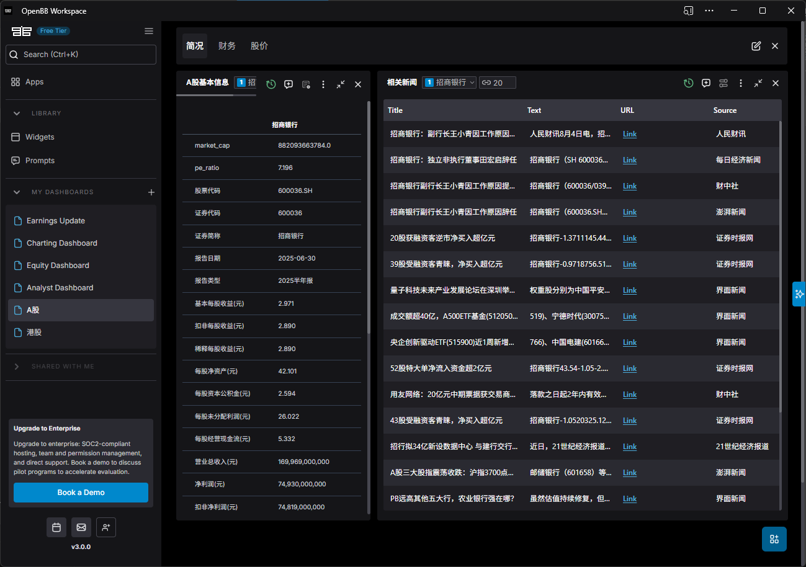
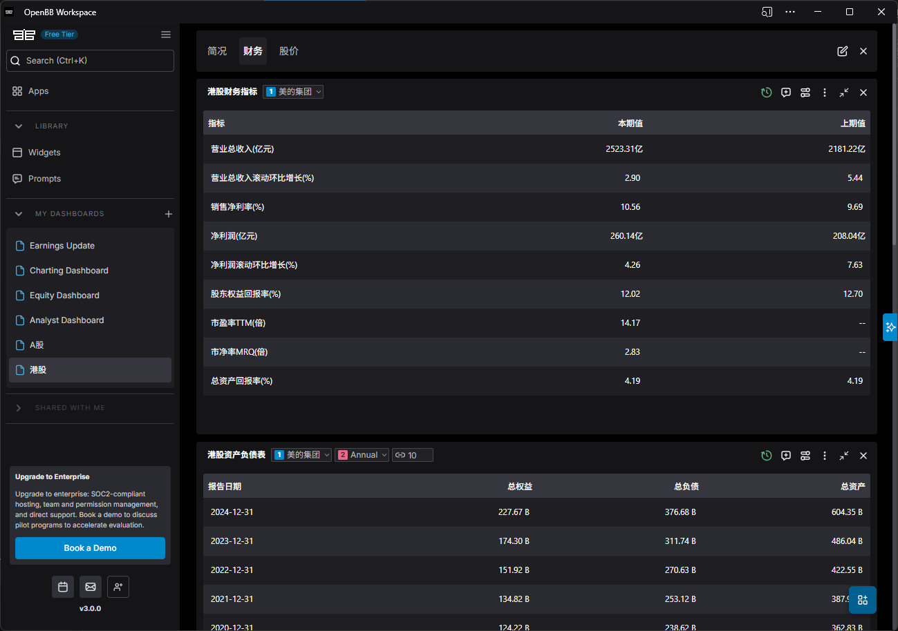
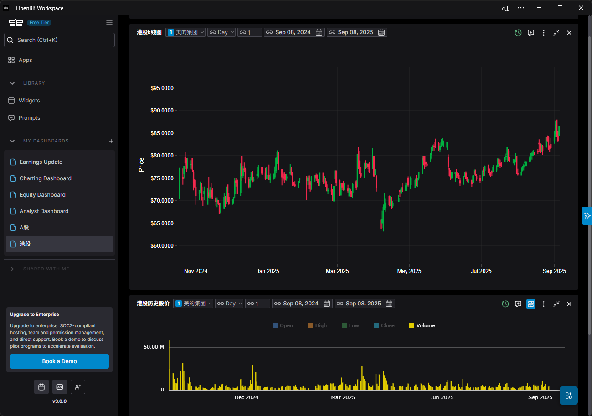

# How to Build A-Share and H-Share Analysis Dashboards Using OpenBB Workspace

openbb-hka is an OpenBB Workspace application that provides templates and components for building analysis dashboards for A-shares and H-shares. It uses openbb-akshare and openbb-tushare as data sources.

Prior to this project, I released OpenBB extensions for AKShare and Tushare data sources. A common question has been: Why develop these extensions, and what is the core value of OpenBB? I attempted to address these in the article *" Introduction to OpenBB and How to Use It to Aid Financial Data Analysis of China A-share and Hong Kong Stocks"*, but truly understanding OpenBB's design philosophy still requires hands-on experience.

Another frequent point of confusion is whether OpenBB has a front-end interface and how to use it. OpenBB Workspace is, in fact, the front-end platform. It allows users to build customized data analysis dashboards. For specific markets such as A-shares and H-shares, we can develop dedicated OpenBB Workspace applications with tailored analytical components — openbb-hka is one such application designed for building dashboards for A-share and H-share analysis.

## Comparison Between OpenBB Workspace Apps and Dashboards

| **Apps**                                          | **Dashboards**                    |
| ------------------------------------------------------- | --------------------------------------- |
| Pre-configured templates with specific analytical goals | Blank canvas for custom configuration   |
| Widgets come with pre-linked parameters                 | Manual parameter configuration required |
| Include curated prompt libraries                        | Start with no predefined prompts        |
| Designed by domain experts for specific workflows       | General-purpose analytical workspace    |

## Environment Setup

### API Key Setup

Although AKShare uses free data sources, an API key is still required when accessing data from Xueqiu. You need to configure the `akshare_api_key` in the file `$HOME/.openbb_platform/user_settings.json` as follows:

```
{
    "credentials": {
        "akshare_api_key": "your {xq_a_token}"
    },
    "preferences": {},
    "defaults": {
        "commands": {}
    }
}
```

### Environment Variables

In addition to the API key configuration above, some settings must be configured using environment variables. You can refer to the `env.example` file for guidance, or create your own `.env` file based on it.

| Variable             | Description                                       |
| -------------------- | ------------------------------------------------- |
| AGENT\_HOST\_URL     | Currently can be left empty                       |
| APP\_API\_KEY        | Use a self-generated JWT token for authentication |
| DATA\_FOLDER\_PATH   | Currently can be left empty                       |
| OPENROUTER\_API\_KEY | Currently can be left empty                       |
| FMP\_API\_KEY        | Currently can be left empty                       |

### Installing `uv`

This project uses `uv` for dependency management. If it's not installed on your system, install it first. After installation, run the following command to sync the environment:

```
uv sync
```

### Running the Application

Start the application using the following command:

```
uv run uvicorn main:app --reload
```

## Using Docker

openbb-hka can also be deployed using Docker.

### Building the Docker Image

Use the following command to build the Docker image:

```
docker build -t openbb-hka:0.2.4 .
```

To use the built image, you need to configure the environment variables in the following files:

* `.env` – Create this file following the environment setup instructions
* `user_settings.json` – Refer to the OpenBB documentation for details

### Running the Docker Image

Start the container using the command:

```
docker compose up
```

## Google Firebase Studio

openbb-hka can also be run using Google Firebase Studio.

## Using openbb-hka in OpenBB Workspace

You can run openbb-hka either locally or deploy it to a cloud environment. Once the application is running, you can add it to your OpenBB Workspace.


As shown in the image above, click the "Connect Backend" button to add the application. After successful addition, two new applications—"A-Shares" and "H-Shares"—will appear in your workspace.

Click on the "A-Shares" application to access the analysis dashboard shown below:



The current interface includes three main sections: **Profile**, **Financials**, and **Stock Price**. You can customize your own analysis dashboard by adding, removing, or adjusting widgets according to your preferences.

Below is a screenshot of the financial analysis panel:



The following image shows the historical stock price query interface:



## AI Integration

All widgets in OpenBB Workspace can be added to the Copilot panel on the right for AI-powered analysis. The OpenBB Copilot is also extensible—you can integrate commonly used AI tools into the platform. This functionality will be further enhanced in upcoming releases.
